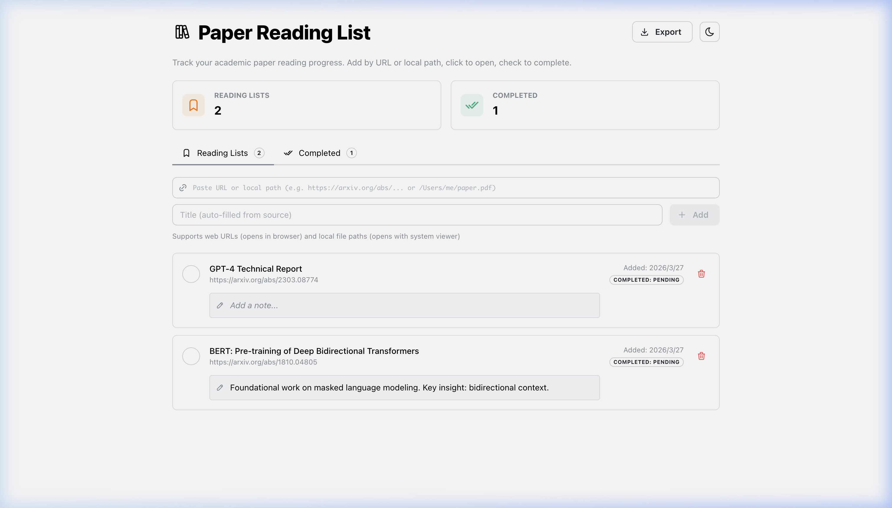
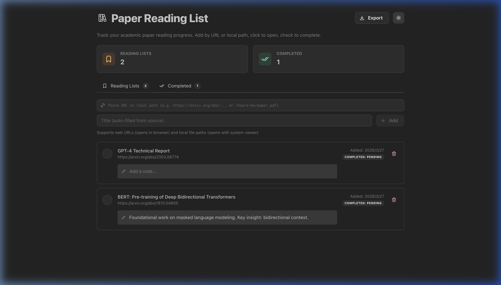

# Paper Reading List

A minimal, locally-hosted academic paper reading manager with persistent SQLite storage.

✨ **Note**: This project was built entirely through **Vibe Coding**—focusing on rapid, AI-assisted development, high-fidelity UI aesthetics, and frictionless prototyping.


*Classic Light Mode*


*Classic Dark Mode*

## Features

- **Classic Minimalist Design**: Premium grayscale aesthetic with full Light and Dark mode support (toggle in header).
- **Dual Source Support**: Add papers via web URL or local file path (both open natively in your browser).
- **Persistent Notes**: Add and save personal notes/comments for each paper.
- **Auto Title Detection**: Automatically derives paper title from URL path or filename.
- **Reading Progress**: Seamlessly move papers between **Reading List** and **Completed**.
- **Duplicate Prevention**: Automatically rejects duplicate entries (by title or source) with auto-dismissing alerts.
- **Export to CSV**: Download your completed reading list as a CSV file for your records.
- **Persistent Storage**: Data is stored in a local SQLite database.

## Setup

### Prerequisites
- [Node.js](https://nodejs.org/) (v20+)
- [uv](https://docs.astral.sh/uv/) (Python package manager)

### Install dependencies

```bash
# Frontend
cd client && npm install

# Backend
cd server && uv sync
```

## Usage

### Start Services (Background)

```bash
chmod +x start.sh stop.sh
./start.sh
```

- **Frontend**: `http://localhost:5187`
- **Backend**: `http://localhost:8787`

### Stop Services

```bash
./stop.sh
```

## Shortcuts & Controls
- **Toggle Mode**: Use the ☀️/🌙 icon in the header.
- **Export**: Click the **Export** button to download your completed list as CSV.
- **Open Paper**: Click the paper row to quickly view the paper in a new browser tab.
- **Edit Note**: Click the note field or the "Add Note" text to edit; auto-saves on blur or Enter.

## Project Structure

```text
paper-reading-list/
├── client/          # React + TypeScript + Mantine frontend
│   ├── src/
│   │   ├── components/   # PaperAddInput, PaperList
│   │   ├── store/        # Zustand state
│   └── vite.config.ts
├── server/          # FastAPI + SQLAlchemy backend
│   ├── app/
│   │   ├── api/          # Route handlers (open via URL or securely serve local files)
│   │   └── models/       # SQLAlchemy models
│   ├── pyproject.toml
│   └── data/papers.db    # Persistent SQLite database
├── start.sh         # Launch both services in background
├── stop.sh          # Kill background processes
└── README.md
```
